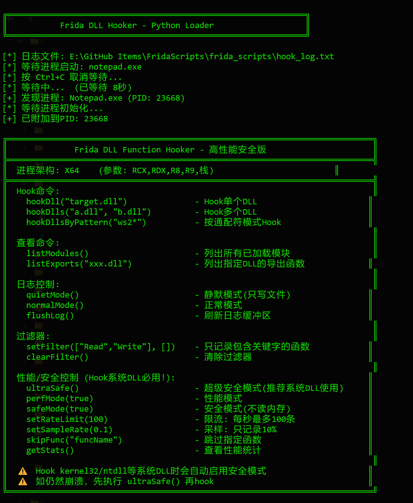
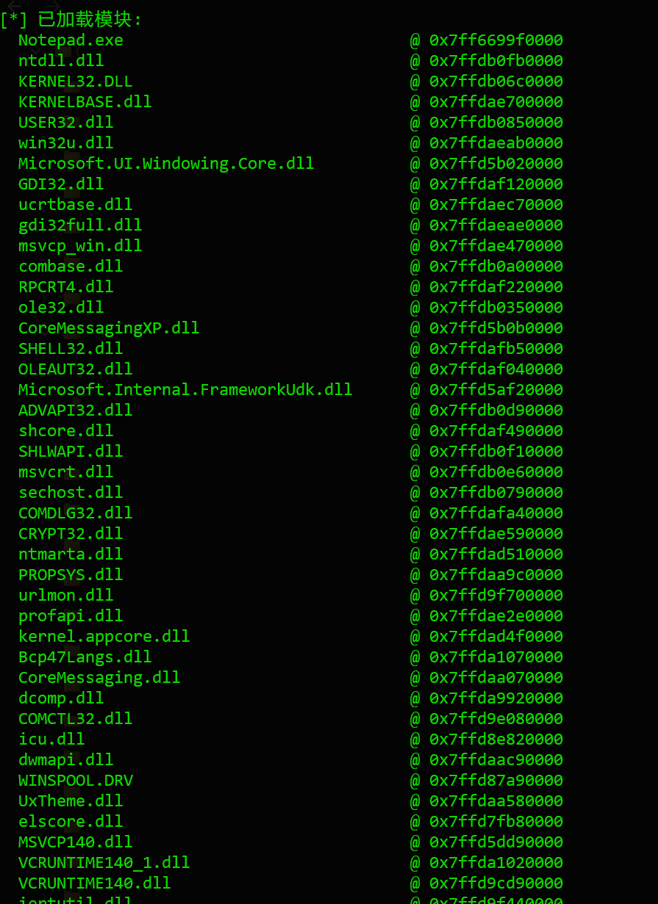
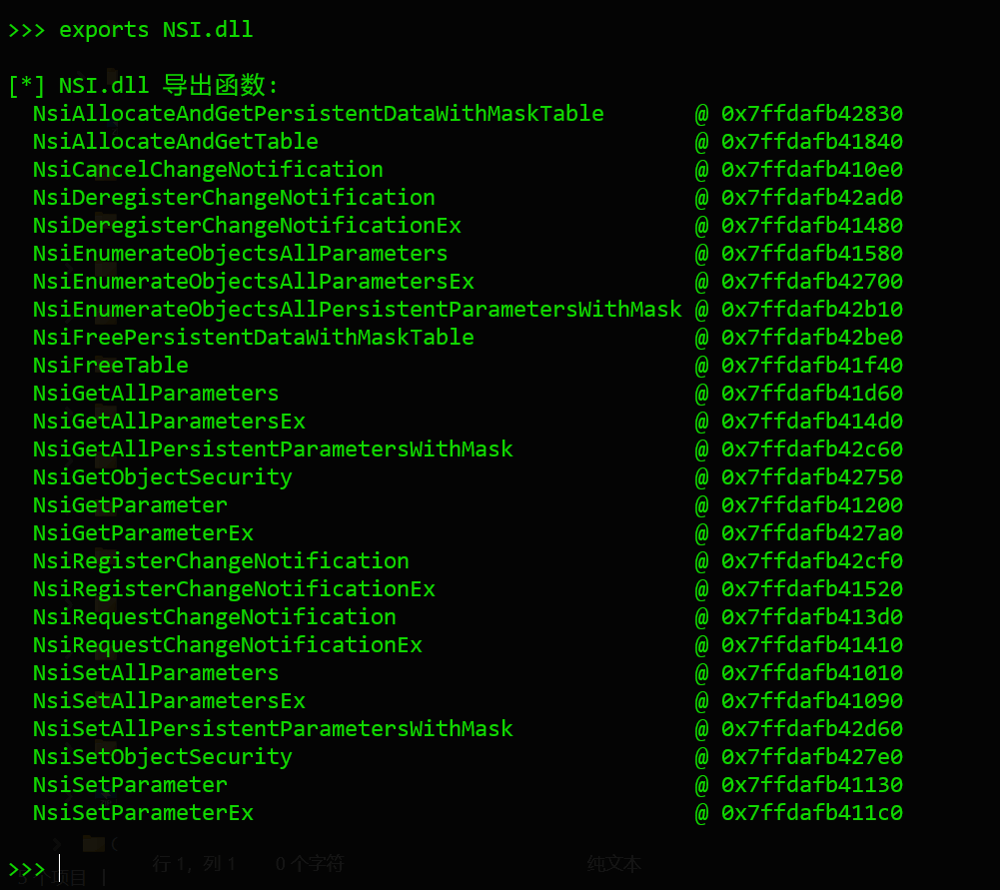
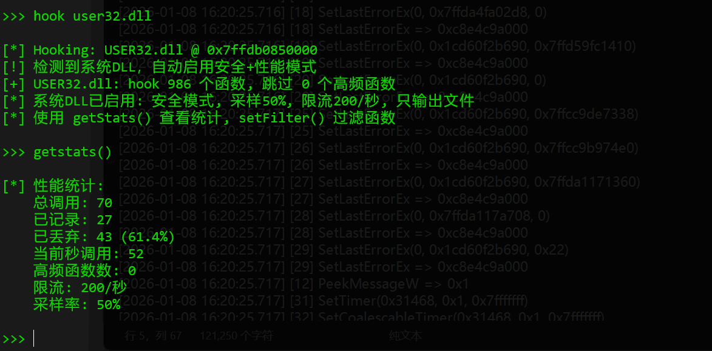

python launcher.py -w notepad.exe -s hook.js



会显示加载的模块



可以导出函数



但是在此次例子中，hook系统dll会默认启用安全模式，不会在屏幕上输出，但是可以在日志文件上看到调用



```
======================================================================
Frida Hook Log - 2026-01-09 00:11:17
======================================================================

[2026-01-08 16:19:45.941] [1] SetCoalescableTimer(0x31468, 0x1, 0)
[2026-01-08 16:19:45.942] [1] SetCoalescableTimer => 0x1
[2026-01-08 16:19:45.942] [2] SetTimer(0x31468, 0x1, 0x7fffffff)
[2026-01-08 16:19:45.942] [3] SetCoalescableTimer(0x31468, 0x1, 0x7fffffff)
[2026-01-08 16:19:45.942] [3] SetCoalescableTimer => 0x1
[2026-01-08 16:19:45.942] [2] SetTimer => 0x1
[2026-01-08 16:19:45.942] [4] MsgWaitForMultipleObjects(0x1, 0x1cd5942ab28, 0)
[2026-01-08 16:19:46.076] [4] MsgWaitForMultipleObjects => 0x1
[2026-01-08 16:19:46.076] [5] PeekMessageW(0xc8e5effc10, 0, 0)
[2026-01-08 16:19:46.078] [6] SetTimer(0x31468, 0x1, 0)
[2026-01-08 16:19:46.078] [6] SetTimer => 0x1
[2026-01-08 16:19:46.079] [5] PeekMessageW => 0x1
[2026-01-08 16:19:46.079] [8] TranslateMessage(0xc8e5effc10, 0, 0xc8e5effaf8)
[2026-01-08 16:19:46.079] [8] TranslateMessage => 0
[2026-01-08 16:19:46.079] [9] DispatchMessageW(0xc8e5effc10, 0, 0xc8e5effaf8)
[2026-01-08 16:19:46.079] [9] DispatchMessageW => 0
[2026-01-08 16:20:25.716] [12] PeekMessageW(0xc8e5effc10, 0, 0)
[2026-01-08 16:20:25.716] [13] SetLastErrorEx(0, 0x1cd60ee02f0, 0)
[2026-01-08 16:20:25.716] [13] SetLastErrorEx => 0xc8e4c9a000
[2026-01-08 16:20:25.716] [15] SetLastErrorEx(0, 0x1cd60ee02f0, 0x7ffda50c56f8)
[2026-01-08 16:20:25.716] [15] SetLastErrorEx => 0xc8e4c9a000
[2026-01-08 16:20:25.716] [16] SetLastErrorEx(0, 0x7ffda51391c8, 0)
[2026-01-08 16:20:25.716] [16] SetLastErrorEx => 0xc8e4c9a000
[2026-01-08 16:20:25.716] [17] SetLastErrorEx(0, 0x1cd60f2b690, 0x7ffda4f72178)
[2026-01-08 16:20:25.716] [17] SetLastErrorEx => 0xc8e4c9a000
[2026-01-08 16:20:25.716] [18] SetLastErrorEx(0, 0x7ffda4fa02d8, 0)
[2026-01-08 16:20:25.716] [18] SetLastErrorEx => 0xc8e4c9a000
[2026-01-08 16:20:25.716] [19] SetLastErrorEx(0, 0x1cd60f2b690, 0x7ffd59fc1410)
[2026-01-08 16:20:25.716] [19] SetLastErrorEx => 0xc8e4c9a000
[2026-01-08 16:20:25.716] [20] SetLastErrorEx(0, 0x1cd60f2b690, 0)
[2026-01-08 16:20:25.716] [20] SetLastErrorEx => 0xc8e4c9a000
[2026-01-08 16:20:25.717] [25] SetLastErrorEx(0, 0x1cd60f2b690, 0x7ffcc9de7338)
[2026-01-08 16:20:25.717] [25] SetLastErrorEx => 0xc8e4c9a000
[2026-01-08 16:20:25.717] [26] SetLastErrorEx(0, 0x1cd60f2b690, 0x7ffcc9b974e0)
[2026-01-08 16:20:25.717] [26] SetLastErrorEx => 0xc8e4c9a000
[2026-01-08 16:20:25.717] [27] SetLastErrorEx(0, 0x1cd60f2b690, 0x7ffda1171360)
[2026-01-08 16:20:25.717] [27] SetLastErrorEx => 0xc8e4c9a000
[2026-01-08 16:20:25.717] [28] SetLastErrorEx(0, 0x7ffda117a708, 0)
[2026-01-08 16:20:25.717] [28] SetLastErrorEx => 0xc8e4c9a000
[2026-01-08 16:20:25.717] [29] SetLastErrorEx(0, 0x1cd60f2b690, 0x22)
[2026-01-08 16:20:25.717] [29] SetLastErrorEx => 0xc8e4c9a000
[2026-01-08 16:20:25.717] [12] PeekMessageW => 0x1
[2026-01-08 16:20:25.717] [31] SetTimer(0x31468, 0x1, 0x7fffffff)
[2026-01-08 16:20:25.717] [32] SetCoalescableTimer(0x31468, 0x1, 0x7fffffff)
[2026-01-08 16:20:25.719] [32] SetCoalescableTimer => 0x1
[2026-01-08 16:20:25.719] [31] SetTimer => 0x1

```

